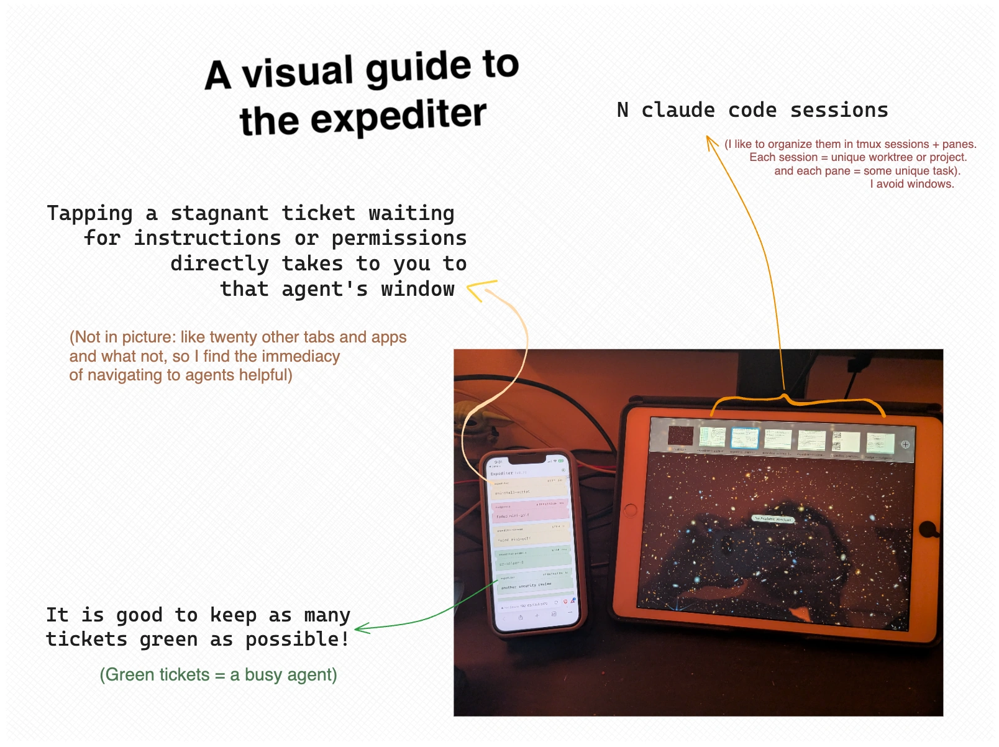

**Expediter puts all your Claude Code sessions one phone tap away.** It is a companion app that minimizes the amount of time and friction it takes to switch between many active agent sessions, thereby enabling you to increase your throughput and steer more coding agents. When you are planning a spec with an agent that spends two minutes thinking while your third agent is awaiting a response while your fifth agent is requesting permission to delete a branch under active development, it should take you seconds to course correct your agents. Expediter makes this trivial!

**How it works once installed:**
1. You run `expediter` in your terminal
2. Use your phone to scan the QR code
3. Start/resume interacting with your claude sessions (in tmux)
4. Once an agent replies, the app will show you tickets, each linked to a unique session
   - Each ticket shows the name, working folder, and status of linked claude session
      - Red ticket = permission request
      - Yellow = awaiting further instructions
      - Green and shining = the agent is working
      - Light grey = waiting for permission for too long / stale session
5. You can tap the ticket to immediately _jump_ to the linked session
6. (optional) Are all your tickets green? Start a new session and further parallelize your work!

## Why

Software engineering in languages with abundant training data is an increasingly low touch job. The *software architect* of today is more like the chef who manages a bunch of line cooks. Coding agents are incredible at cooking ... their work done per unit time is magnitudes higher than that of humans. This makes agent-minutes extremely valuable. An agent stuck on a request or veering onto an unproductive path is costly, especially when executing a long spec because each delay piles up. If we want to optimally increase our throughput while retaining varying but non-zero levels of oversight over a fleet of agents, it makes sense to minimize the amount of time it takes to switch from one agent to another. Even if you aren't optimizing but simply babysitting many agents, it is beneficial to have a simple tool that makes it easy to access any of your agent sessions.

I hope that the expediter helps you manage more agents or manage few of them better by putting you in a loop with them. I have been using it and **it has helped eliminate the time it takes hopping from agent number one to five to three to four** (I am also someone who always has too many tabs and windows open) + **enabled me to manage more agents than I otherwise would have**.

I don't know if this is the optimal shape for a multi-agent manager, so at the moment, I want to see if the core UX resonates with others. Give it a go and share what you think of it!



--

Needless to say, I built this because I was unhappy with all the existing agent management interfaces. Claude Code's official remote control feature demands telemetry. The open-source spin-offs are fine but they also try to be a terminal on your phone, which serves a purpose, but not the problem I was facing.

The human-in-the-loop does impose some inherent constraints; there are some who expect humans will be RL-ified from software engineering altogether. Even if that comes to pass, there will still be those who would exercise their agency, orchestrate many talking machines, and find value in building.

## Install

macOS only for now. The installer is interactive but the happy path is two prompts.

```bash
git clone https://github.com/AsteroidHunter/expediter.git
cd expediter
./install.sh
```

<details>
<summary>The installer will ...</summary>

1. Check for [Claude Code](https://docs.claude.com/en/docs/claude-code/setup) and offer to install it if missing.
2. Check for tmux, Homebrew, and Bun, and offer to install whatever's missing in one go. (Homebrew's installer prompts for your Mac password -- that's normal and unavoidable.)
3. Build the app (`bun install` + `bun run build`).
4. Write `~/.config/expediter/config` so the shims can find your clone (`EXPEDITER_HOME` points at the repo path).
5. Drop two commands into `~/.local/bin/`, and add that directory to `~/.zshrc` if it isn't already on your `PATH`:
   - `expediter` -- starts the daemon (if it's not already running) and prints the URL + a scannable QR code for your phone.
   - `claudex` -- opens a fresh tmux session with `claude` and `expediter` in side-by-side panes, so you can start a session with one command.
6. Offer to merge Expediter's hook entries into `~/.claude/settings.json` (with a timestamped backup).
7. Offer to apply Expediter's tmux styling via `source-file` in `~/.tmux.conf` (with a backup if you already have one).

</details>

## How to use

First, make sure your phone and your Mac are on the same Wi-Fi network.

If you're an opinionated tmux user, just run:

```bash
expediter
```

A QR code shows up in your terminal. Scan it with your phone's camera and open the link in Safari. The first time you connect a phone you install a small certificate so it trusts the connection (see [First connection](#first-connection-trust-the-certificate) below); after that, scanning just works.

However, there's another command if you want to start a fresh Claude Code session along with the Expediter daemon:

```bash
claudex
```

That opens a tmux session with `claude` and `expediter` in side-by-side panes.

If you're new to tmux or Claude Code, try:

```bash
claudex uno
```

That starts the daemon, prints the QR, and walks you through four numbered onboarding steps below it.

### First connection: trust the certificate

Expediter serves over HTTPS by default. A trusted HTTPS connection is what lets your phone install Expediter to its home screen as an app, and it encrypts everything between phone and Mac. In return, HTTPS needs your phone to trust the daemon's certificate -- a one-time setup per phone:

1. Run `expediter`. On first start it creates a local certificate authority at `~/.expediter/tls/ca.crt`.
2. Get `ca.crt` onto your phone. AirDrop is easiest: right-click it in Finder > Share > AirDrop.
3. On the phone, open the file and install the profile under Settings > General > VPN & Device Management.
4. Turn trust on under Settings > General > About > Certificate Trust Settings (enable "Expediter Local CA").
5. Scan the QR. You're connected, with a real lock icon.

This is once per phone, and the certificate is long-lived. Don't want to bother? Run `expediter --http` for plaintext instead: no certificate, but no home-screen install, and the connection is readable by a sniffer on your network. The choice sticks (saved to `~/.expediter/config.json`); switch back with `expediter --https`.

### Network requirements

Expediter needs your phone to reach your Mac at its LAN IP. That's fine on home Wi-Fi and most office or coworking networks. Two situations where it won't work:

- **Wi-Fi with client isolation.** Some hotel and airport Wi-Fi, and some company guest networks, block peer-to-peer traffic at the access point. Your phone can't reach your Mac no matter what the QR says.
- **Captive portals.** Requests get intercepted until you sign in. Complete the sign-on on both devices first, then re-run `expediter`.
- **Wi-Fi that blocks mDNS.** The default HTTPS QR points at your Mac's `.local` name (Bonjour/mDNS). The same client isolation and multicast filtering that breaks the case above also stops `.local` from resolving. If the HTTPS QR won't load but both devices are on the same network, fall back to `expediter --http`, which uses the raw IP instead.

On HTTPS the QR points at your Mac's stable `.local` name, so switching networks doesn't invalidate it (as long as the new network allows mDNS). On `--http` the QR encodes the raw IP, so a new network means a new address -- re-run `expediter` for a fresh QR.

## Security & access control

Expediter trusts your local network, like Plex, Sonos, or a Philips Hue bridge. Anyone on the same Wi-Fi can reach the daemon's port; a per-session token gate stops them from doing anything once they reach it.

The token is 16 cryptographically random bytes, base64url-encoded (~22 characters), held only in the daemon's process memory -- there is no token file on disk. The QR you scan encodes the token in the URL fragment (`https://<host>.local:5179/#<token>`); browsers never transmit URL fragments to servers, so the token stays out of request logs, server access logs, and proxy logs. Your phone's inline page script reads the fragment, stashes it in `sessionStorage`, and immediately clears the address bar.

Every time you stop and restart the daemon (Mac reboot, manual stop+start, crash + relaunch, `expediter` re-invocation), a fresh token is minted in the new process. The old QR stops working; your phone will prompt you to re-scan. There is no rotation ceremony beyond "restart the daemon."

**What this stops:** uninvited devices on the same Wi-Fi (no token, can't reach `/api/*`), borrowed-phone access creep (the token dies when you stop the daemon), and post-session token replay (the new daemon process knows nothing about the old token).

**Transport security.** On the default HTTPS transport, traffic between phone and Mac is encrypted, so a packet sniffer on your Wi-Fi sees only ciphertext. If you opt into `--http`, ticket data and the token travel in the clear: a sniffer on the same network could read them and, with a captured token, briefly pop your Terminal window forward (until the daemon restarts and mints a new one). On `--http`, stick to trusted Wi-Fi.

The daemon also trusts processes on your own Mac -- anything running as your user account can POST hook events without a token (via `127.0.0.1`) and can fetch the current token from a loopback-only `/api/token` endpoint. This is the same trust boundary the operating system already enforces around your home directory, Anthropic API keys, and SSH keys; the token gate's job is to extend that trust selectively to your phone.

### Running the daemon

`expediter` runs the production build (`bun ./build/index.js`) under the hood. SvelteKit's built-in CSRF check is production-only, so the production build is the supported deployment surface. `bun run dev` is for contributors changing the code; don't use it as your everyday daemon.

## Update

Already installed? Pull the latest and rebuild in place with one command -- no need to uninstall and reinstall:

```bash
expediter update
```

Or run it directly from the clone:

```bash
./update.sh
```

Afterwards, restart the daemon (Ctrl-C the `expediter` terminal and re-run it) to load the new build.

<details>
<summary>The updater will ...</summary>

1. `git pull --ff-only` the current branch -- skipped if you pass `--dev`/`--no-pull`, your checkout has local changes, or the branch can't fast-forward. It never forces or merges; in those cases it just rebuilds what's on disk.
2. Rebuild the app (`bun install` + `bun run build`).
3. Rewrite the `expediter` / `claudex` shims and config, and re-copy the `cc-clock` / `cc-dates` status-bar helpers.
4. Re-merge Expediter's hook entries into `~/.claude/settings.json` (timestamped backup first), so any newly added events register.

Contributors working on a branch can skip the pull with `expediter update --dev` (or `./update.sh --dev`) to rebuild the current checkout as-is.

</details>

## Uninstall

```bash
./uninstall.sh
```

<details>
<summary>The uninstaller will ...</summary>

1. Check that the daemon isn't running (abort if it is, so it doesn't leave an orphaned `bun` process).
2. Ask for one top-level confirmation.
3. Remove `~/.local/bin/expediter` and `~/.local/bin/claudex`.
4. Remove `~/.config/expediter/config` (and the parent directory if it ends up empty).
5. Splice Expediter's hook entries out of `~/.claude/settings.json` (timestamped backup first).
6. Splice the `source-file` line for `expediter.tmux.conf` out of `~/.tmux.conf` (timestamped backup first; deletes the file if it ends up empty).
7. Remove `~/.expediter-install.log`.

It does NOT touch the cloned repo, Claude Code, Homebrew, tmux, Bun, your `PATH`, or any install-time backups.

</details>
